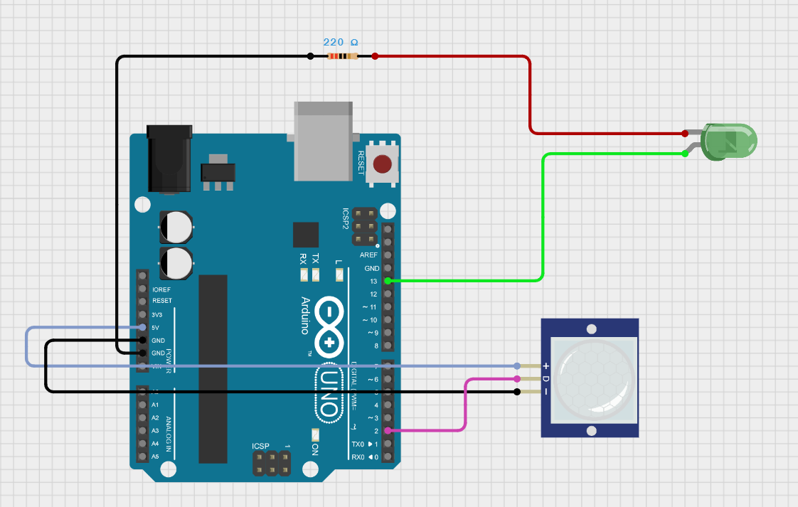
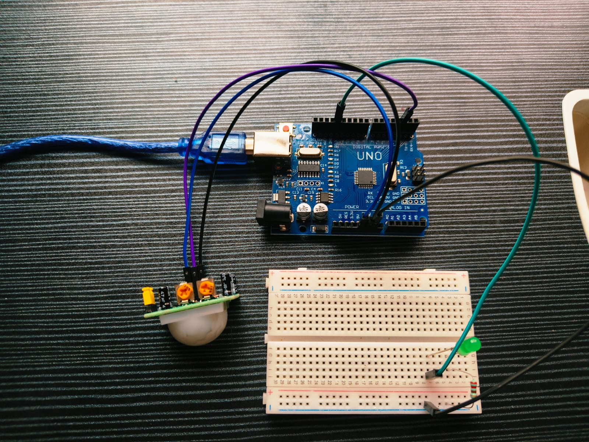

# Real-Time Occupancy Detection System for Energy Efficiency
### Problem Statement

Develop a real-time occupancy detection system that automatically controls lighting based on human presence to improve energy efficiency.

---

## Objectives

- Detect human occupancy using a PIR sensor.
- Automatically control lighting based on occupancy.
- Reduce unnecessary energy consumption.
- Demonstrate embedded system automation using Arduino Uno.

---

### **Scope of the Solution**

The system detects motion using a PIR sensor.
- Light turns ON when occupancy is detected.
- Light turns OFF after 10 seconds of inactivity.
- Reduces unnecessary power consumption.
- Can be extended for classrooms, offices, and smart homes.

---

### **Components Required**

## Hardware Components

| Component | Quantity |
|------------|------------|
| Arduino Uno | 1 |
| PIR Motion Sensor | 1 |
| LED | 1 |
| 220Ω Resistor | 1 |
| Breadboard | 1 |
| Jumper Wires | As Required |

## Software Components

- Arduino IDE
- Cirkit Designer

---

## Circuit Diagram

---

## Hardware Prototype

Actual implementation of the Real-Time Occupancy Detection System using Arduino Uno, PIR Motion Sensor, LED, resistor, and breadboard.

---

## Circuit Simulation Link

[View Cirkit Designer Simulation](https://app.cirkitdesigner.com/project/fc8c1c20-c3ee-4f36-a7d3-30ea475516cd)

---

## Arduino Code

[View Arduino Source Code](Occupancy_Detection.ino)

---

## Working

1. PIR sensor detects motion.
2. LED turns ON when motion is detected.
3. If no motion is detected for 10 seconds, LED turns OFF.
4. Energy consumption is reduced by avoiding unnecessary lighting.

---

## Results

| Test Case | Output |
|------------|------------|
| No Occupancy | LED OFF |
| Occupancy Detected | LED ON |
| No Motion for 10 Seconds | LED OFF |

The system successfully detected occupancy and controlled lighting automatically.

---

## Project Report

[View Project Report PDF](Project_Report.pdf)

---

## Gerber Files

PCB Gerber files generated using EasyEDA are available in the repository and can be used directly for PCB fabrication.
[Download Gerber Files](Gerber_Files.zip)
---

## Demo Video

Demo video will be uploaded soon.

---
## Future Scope

- Smart classroom automation
- IoT monitoring
- Attendance systems
- Smart home integration

---

## Author

**Manaswi Dulla**  
24BEC7025  
Electronics and Communication Engineering  
VIT-AP University
